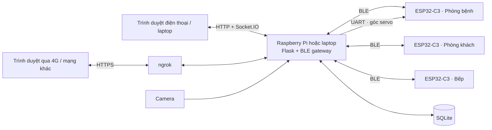

# AIoT Care

Hệ thống giám sát và điều khiển **phòng người bệnh, phòng khách và phòng bếp**.
Raspberry Pi nhận dữ liệu từ ba ESP32-C3 qua BLE, xử lý tại backend Python và
cập nhật dashboard theo thời gian thực. Laptop Windows có thể dùng để thử node bếp.

[Sơ đồ chân](docs/HARDWARE.md) · [Cài đặt & vận hành](docs/SETUP.md) ·
[Firmware](esp32_firmware/README.md) · [API](docs/API.md)

## Chức năng

| Khu vực | Theo dõi | Điều khiển |
| --- | --- | --- |
| Phòng người bệnh | Nhiệt độ, độ ẩm, PIR; camera, cử chỉ và phát hiện té ngã | Đèn, quạt, còi, servo quay camera |
| Phòng khách | Nhiệt độ, độ ẩm, BH1750, hiện diện HLK-LD2420 | Đèn, quạt, chế độ tự động |
| Phòng bếp | Giá trị gas ADC, khói, lửa | Cửa sổ, quạt hút, đèn, còi |

Dashboard có tổng quan ba phòng, trạng thái kết nối, cảnh báo, lịch sử cảm biến,
và trang quản trị tài khoản. Dự án **không sử dụng vòng đeo tay**.
Đèn phòng bệnh dùng relay tại GPIO4. Lịch sử cảm biến được lưu định kỳ vào SQLite.

## Kiến trúc



Ba node kết nối BLE trực tiếp với gateway; không dùng MQTT hay BLE Mesh.
Ngrok chỉ đưa web ra Internet, không thay thế kết nối BLE giữa gateway và các node.
Logic tự động cục bộ của bếp/phòng khách nằm trong firmware.

## Chạy thử trên Windows

Từ thư mục dự án, dùng môi trường Python đã cài các gói trong `requirements.txt`:

```powershell
python run_kitchen_test.py
```

Mở **http://127.0.0.1:5000/dashboard**. Chế độ này dùng `kitchen-test.db`, chỉ kết nối
BLE node bếp và tắt camera/UART khi khởi động. Các nút điều khiển tác động tới
phần cứng thật. Không chạy thêm bản thứ hai nếu cổng 5000 đang được sử dụng.

Thử bằng điện thoại qua mạng khác, mở PowerShell thứ hai:

```powershell
ngrok http 5000 --inspect=false
```

Mở địa chỉ HTTPS do ngrok hiển thị và đăng nhập. Laptop phải bật, không sleep và
có Internet. Xem [thiết lập ngrok lần đầu](docs/SETUP.md#ngrok-trên-laptop).

## Triển khai trên Raspberry Pi

Tạo môi trường Python, cài `requirements.txt`, cấu hình `.env` và chạy `python app.py`.
Web lắng nghe cổng 5000; truy cập `http://<IP-của-Pi>:5000/dashboard` trong mạng LAN.
[Hướng dẫn chi tiết](docs/SETUP.md) giải thích MAC BLE, camera, UART và dịch vụ systemd.

## Sơ đồ chân

Bảng đầy đủ cho cả ba node ở **[docs/HARDWARE.md](docs/HARDWARE.md)**,
kèm [CSV hiện tại](docs/hardware/pinout.csv), đối chiếu trực tiếp các hằng `PIN_*` trong firmware.

Pin bếp: **MP-2 AO → GPIO0 · DO → GPIO1 · Flame DO → GPIO2 · Servo → GPIO4 ·
Buzzer → GPIO5 · Quạt IN1/IN2 → GPIO7/GPIO8 · Relay đèn → GPIO20**.

## Cấu trúc repo

```text
app.py                 Khởi tạo ứng dụng và dịch vụ nền
config.py              Cấu hình qua biến môi trường / .env
web.py                 Trang web, API, xác thực, sự kiện Socket.IO
iot.py                 BLE, camera, trạng thái và cảnh báo
node_protocol.py       Hợp đồng lệnh điều khiển ba node
database.py            SQLite: tài khoản, cấu hình, nhật ký và lịch sử cảm biến
run_kitchen_test.py     Chạy thử node bếp trên Windows
templates/             Trang Jinja: dashboard, đăng nhập, đăng ký
static/                CSS và JavaScript
esp32_firmware/        Firmware ba node và header dùng chung
docs/                  Hướng dẫn, API, sơ đồ chân và thiết kế giao diện
tests/                 Kiểm thử Python và logic firmware C++ trên máy
```

`aiot-care.service` và `update.sh` là công cụ triển khai Pi, cần đọc và chỉnh theo máy
trước khi sử dụng. Database, log, môi trường Python không đưa lên Git.

## Kiểm tra

```bash
python -m unittest discover -s tests -v
git diff --check
```

Test Python dùng các dependency giả lập; test logic firmware cần `g++` và sẽ báo
skip nếu thiếu compiler. Kết quả này không thay thế việc biên dịch toàn bộ sketch
và thử cảm biến/thiết bị trên ESP32 thật.
